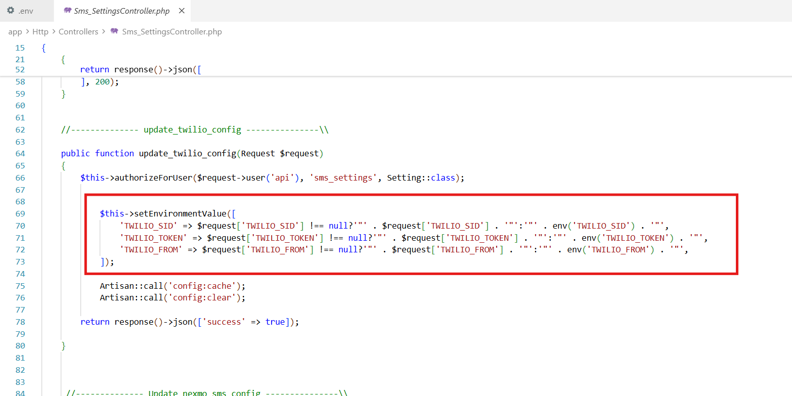
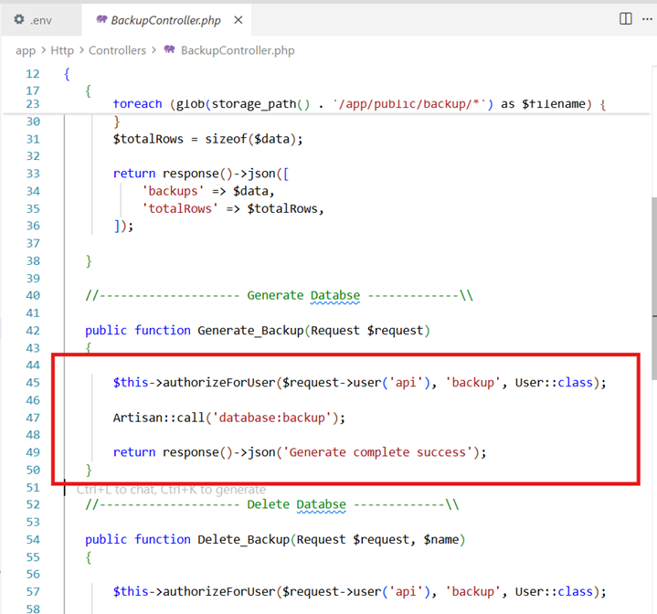
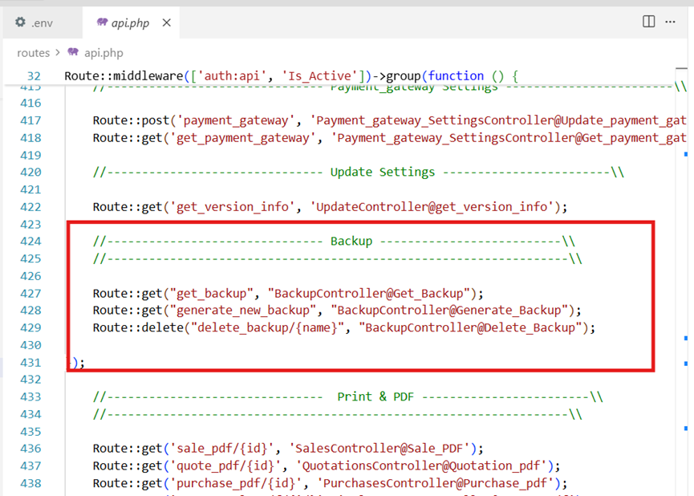
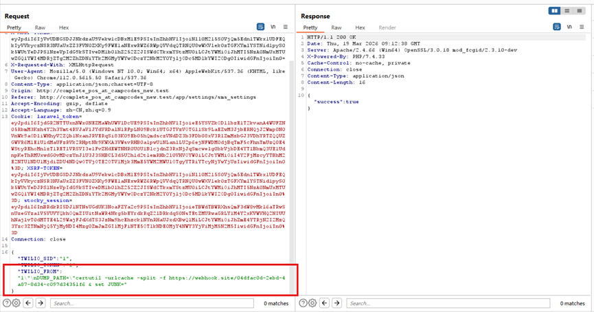
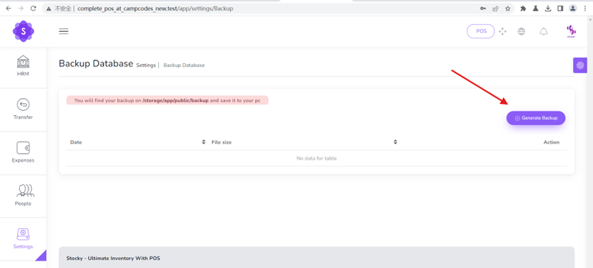
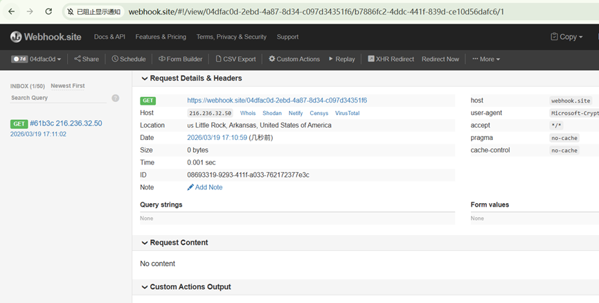

## Title: Authenticated Remote Code Execution (RCE) via Configuration Injection in Stocky POS

**BUG_Author:** Chenkh

**Affected Version:** Stocky POS v4.0.6 (and potentially earlier versions)

**Vendor:** **https://www.campcodes.com/**

**Software:** Stocky - Ultimate Inventory With POS（[完整的 POS 管理和库存系统，包含条码，采用 PHP MySQL [更新于 2024 年\] |营地代码 --- Complete POS Management And Inventory System With Barcode In PHP MySQL [UPDATED 2024] | Campcodes](https://www.campcodes.com/projects/php/complete-pos-management-and-inventory-system-in-php-mysql/)）

**Vulnerable File:**

- `app/Http/Controllers/SettingsController.php` 
- `app/Console/Commands/DatabaseBackUp.php` 

## Description:

1. **Arbitrary Environment Variable Injection via Insufficient Sanitization:**

   - The backend API responsible for updating system configurations (such as Twilio SMS settings) fails to properly sanitize user input before writing it to the root `.env` configuration file.
   - An authenticated attacker can insert newline characters (`\n`) within the JSON payload. When the backend processes this, it breaks out of the intended variable definition and injects arbitrary, attacker-controlled environment variables directly into the `.env` file.

2. **Configuration Override via `.env` Parsing Behavior:**

   - The Laravel framework parses the `.env` file sequentially from top to bottom. If a variable is defined multiple times, the last occurrence takes precedence.
   - By injecting into settings that are typically stored at the bottom of the `.env` file (e.g., `TWILIO_FROM`), the attacker's injected variable effectively overrides critical system variables defined earlier, such as `DUMP_PATH` (which dictates the executable path for the `mysqldump` utility).

3. **Remote Code Execution (RCE) Impact:**

   - When an administrator triggers the "Generate Backup" function, the application reads the poisoned `DUMP_PATH` variable and concatenates it directly into a system command executed via PHP's `exec()` function without adequate escaping.

   - This allows the attacker to execute arbitrary Operating System commands (e.g., `certutil`, `curl`, `whoami`) with the privileges of the Web Server (e.g., Apache/Nginx), leading to complete system compromise, data exfiltration, and unauthorized access.

     

## Proof of Concept:

1. **Prepare and Inject the Malicious Payload:** Authenticate as an administrator and submit a `POST` request to the Twilio configuration update endpoint. The payload injects a newline (`\n`) to redefine the `DUMP_PATH` with a malicious command (e.g., using `certutil` for Out-of-Band exfiltration) and uses `& set JUNK=` to absorb subsequent hardcoded parameters:

   

2. **Trigger the Payload (RCE):** Send a `GET` request to the database backup generation endpoint. This action forces the backend to invoke the `exec()` function using the poisoned `DUMP_PATH`.

   

3. **Verify the Exploit:** - Check the attacker-controlled server (e.g., Webhook.site). An HTTP request originating from the target server will be logged, confirming that the arbitrary `certutil` or `curl` command was successfully executed.

   - Alternatively, inspect the target server's active processes or endpoint protection logs (e.g., Windows Defender) to confirm the spawned command-line execution and parameter hijacking.

