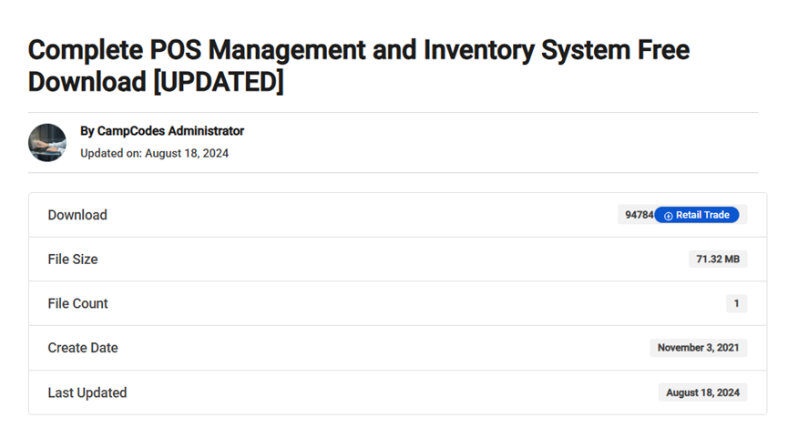
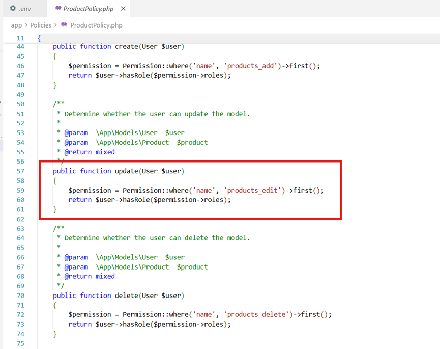
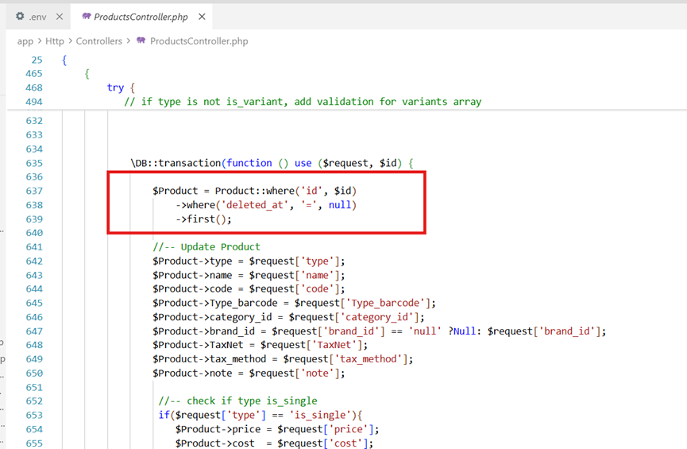
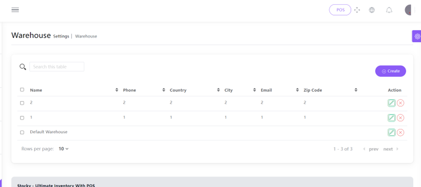
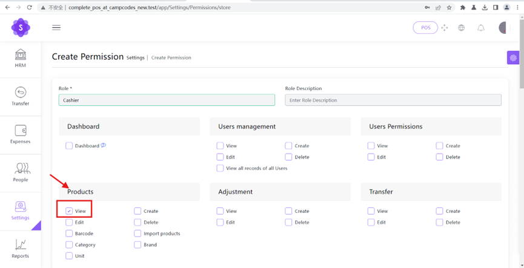
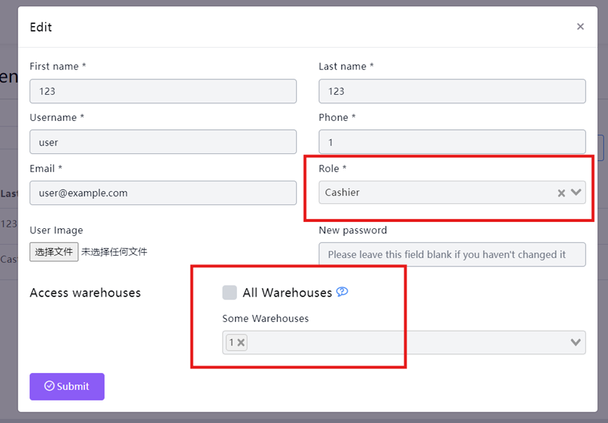
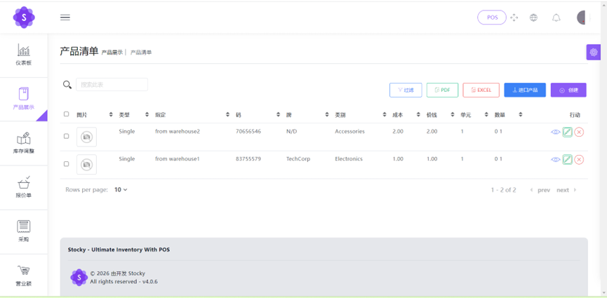
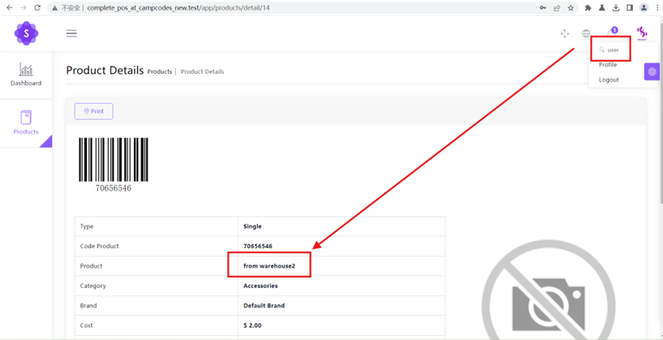
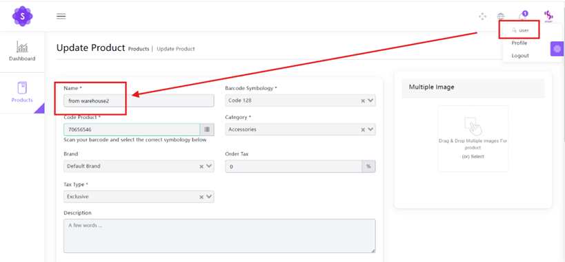

**Stocky POS System Business Logic Unauthorized Access Vulnerability** 

I. Basic Vulnerability Information 

- **Affected Asset Official Homepage Link:** https://www.campcodes.com/ 

- **Affected Asset Detail Page Link:**  Complete Online Learning Management System In PHP MySQL Source Code | Campcodes 

  

II. Vulnerability Description Campcodes is a well-known open-source project code hosting platform, and the affected system, Complete POS Management and Inventory System, has over 90k downloads on this platform. 

The Stocky - Ultimate Inventory With POS system hosted on the Campcodes platform contains severe Broken Object Level Authorization (BOLA/IDOR) and vertical privilege escalation vulnerabilities. Attackers can exploit the lack of "warehouse scope" validation in the data query and update interfaces to gain unauthorized access to sensitive commercial data (accurate inventory, cost price, etc.) of all branch stores and the main warehouse. Furthermore, they can vertically escalate privileges to arbitrarily modify the prices and attributes of any system product. During the update, this triggers flawed framework-level logic that forcibly associates the tampered product with all warehouses, causing widespread business data pollution and severe financial security threats. 

III. Required Privileges: Ordinary employee / low-privileged user (e.g., a Cashier account assigned basic product view/edit permissions but strictly restricted to a specific warehouse, such as Warehouse 1). 

IV. Code Audit 

- `/app/Policies/ProductPolicy.php` (Lines 57-61): The method signature does not pass a specific `$product` instance. It only validates the basic role permission via `Permission::where('name','products_edit')`, without verifying whether the product belongs to the warehouse scope authorized to the user. 

- `/app/Http/Controllers/ProductsController.php` (Lines 637-639 & Lines 706-708): When executing updates, the system does not use the current user's authorized warehouse list; instead, it directly queries all warehouse IDs in the database and writes them into the `product_warehouse` association table, leading to data pollution. 

  

  

V. Vulnerability Reproduction 

- The User account only has view permissions for Warehouse 1. 

- There are two products, belonging to Warehouse 1 and Warehouse 2 respectively. 

- The User account can view the product from Warehouse 2. 

- If the 'edit' permission is granted to the user, they can arbitrarily modify products from other warehouses. 

  

VI. Temporary Solutions: 

1. **Monitor Updates:** Keep an eye on the official website for patch updates. 

2. **Fix Authorization Policies:** Modify the method signature in `ProductPolicy.php` to strictly require the resource instance (e.g., `update(User $user, Product $product)`), and add internal logic to verify whether the user's authorized warehouses intersect with the warehouse to which the `$product` belongs. 

3. **Introduce Global Scopes:** In the `Product` model and related underlying API queries, forcefully add data scope restrictions like `whereIn('warehouse_id', auth()->user()->allowed_warehouses)` to completely eliminate IDOR. 

4. **Fix Business Data Pollution Logic:** In the `store` and `update` methods of `ProductsController.php`, remove the dangerous logic of directly retrieving `Warehouse::all()`. The establishment of product-warehouse relationships must be strictly limited to the warehouse permission list possessed by the current operator. 

   

   