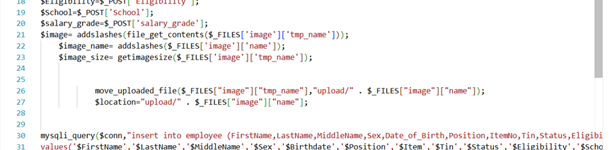
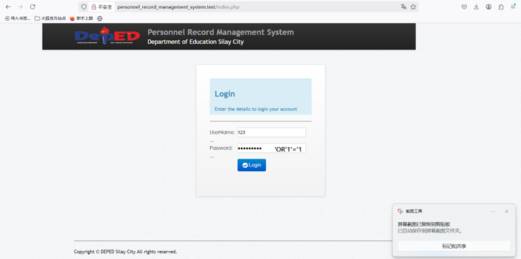
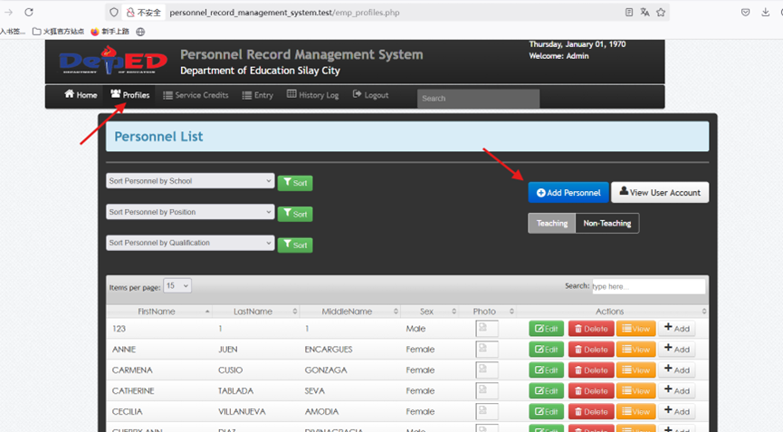
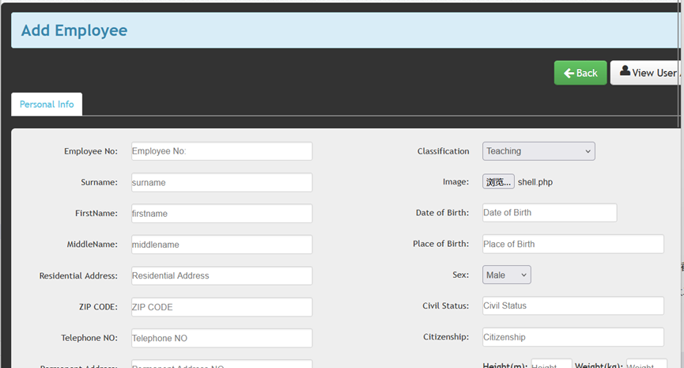
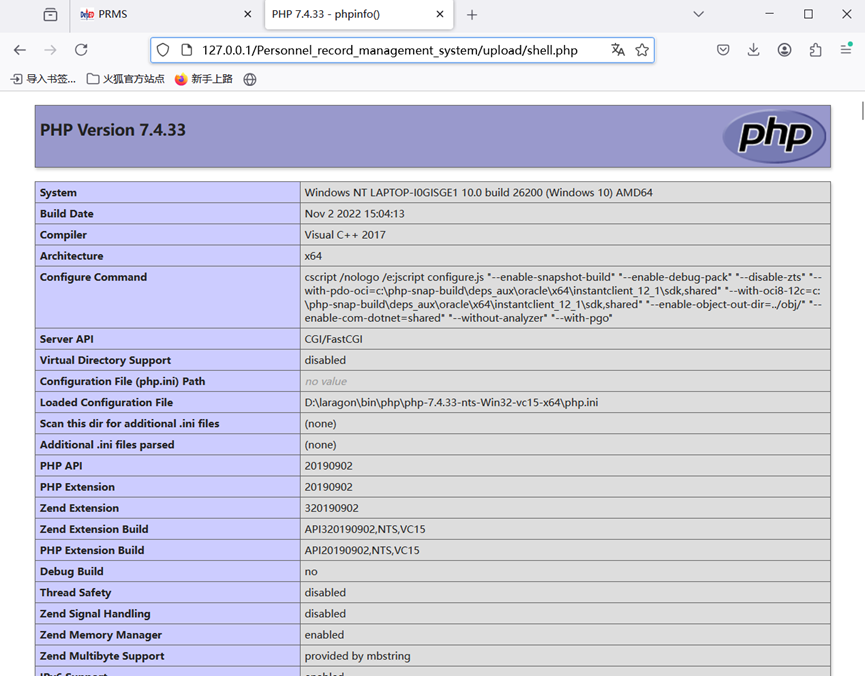

### **Vulnerability Title: Personnel Record Management System Arbitrary File Upload to RCE Vulnerability**

------

### **I. Basic Vulnerability Information**

- **Open Source Project Link:** [sourcecodester.com/php/5107/record-management-system.html](https://www.sourcecodester.com/php/5107/record-management-system.html)


- **Context:** Sourcecodester is a well-known open-source code and application sharing platform. The affected system, "Personnel Record Management System," has accumulated over 29,000 downloads on this platform.
- **Vulnerability Type:** Arbitrary File Upload leading to Remote Code Execution (RCE).
- **Affected Component:** File upload module (`save_emp.php`).

------

### **II. Vulnerability Description**

The employee information entry interface contains a critical, unrestricted file upload vulnerability. This flaw serves as the primary vector for a Remote Code Execution (RCE) attack. Attackers can bypass file type verification and authorization mechanisms to directly upload malicious WebShell scripts to the server. Once the WebShell is successfully uploaded, the attacker instantly gains server-level privileges, achieving full RCE. This allows the attacker to remotely execute arbitrary system commands, alter server configurations, steal core business data, implant ransomware or cryptominers, and potentially pivot laterally to compromise other servers within the internal network.

------

### **III. Code Audit**

**Root Cause: Unrestricted Arbitrary File Upload**

- **Vulnerable File:** `save_emp.php` (Lines 21-27)



- **Code Audit / Analysis:** The system utilizes the `move_uploaded_file()` function to process the `image` field submitted from the form, saving it directly to the `upload/` directory located in the web root. Although the application calls the `getimagesize()` function (Line 23), it completely fails to use its return value to evaluate or block non-image files. Furthermore, there is absolutely no server-side whitelist validation on the file extension (e.g., checking for `.php` extensions). Consequently, any file type, including executable malicious PHP scripts, can be uploaded and stored securely on the server.

### **IV. Proof of Concept (PoC)**

#### **Step 1: Authentication Bypass**

- Use the previously discovered SQL injection payloads on the login page to gain unauthorized access to the Administrator dashboard.
  - **Payload Example:** `UserName=123' RLIKE (SELECT (CASE WHEN (1470=1470) THEN 123 ELSE 0x28 END))-- GrAC&Password='OR'1'='1&Login=`



#### **Step 2: Upload Malicious Payload (WebShell)**

- Navigate to the "Add Employee" (`Add Personnel`) module in the admin interface.



- Create a malicious PHP file named `shell.php` with the following content:

  ```
  <?php
      phpinfo();
  ?>
  ```



- Submit this `shell.php` file through the "Image" upload field within the form and save the profile.

#### **Step 3: Trigger Payload and Execute Code**

- Navigate directly to the uploaded file's path via the browser: `http://127.0.0.1/Personnel_record_management_system/upload/shell.php`
- **Result:** The PHP code executes successfully on the server (displaying the PHP configuration info page), demonstrating a successful Remote Code Execution (RCE).



### **V. Remediation / Solutions**

1. **Patch Management:** Closely monitor the official channels or relevant security communities for this open-source project. Immediately deploy security patches or update to a newer version in the production environment once released by the developers.
2. **Strict File Upload Validation:** Strictly adhere to the "Never trust external input" security principle. Specifically for the file upload interface, it is mandatory to establish a strict server-side format whitelist (e.g., allowing only `.jpg`, `.png`, `.gif`), implement rigorous MIME type validation, and enforce a mandatory random renaming mechanism for uploaded files to prevent attackers from guessing the file path or executing scripts.
3. **Principle of Least Privilege:** Enforce minimum database permissions. Assign the system a dedicated database account equipped only with the read/write privileges strictly necessary for current business operations. Never use highly privileged accounts (e.g., `root`) to connect to the database, limiting the potential blast radius of vulnerabilities.
4. **Environment Hardening:** It is strongly recommended to forcefully disable PHP error echoing (`display_errors = Off`) in production environments to prevent sensitive system information leakage. Additionally, consider deploying a Web Application Firewall (WAF) to intercept common injection and malicious upload attack signatures, and conduct regular secure code audits.